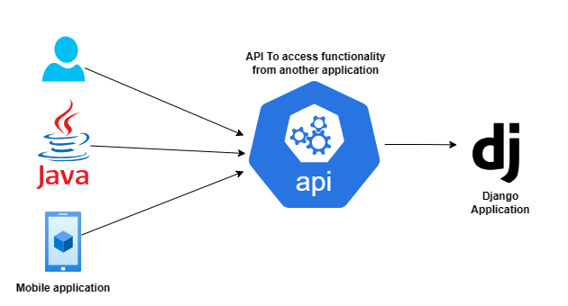
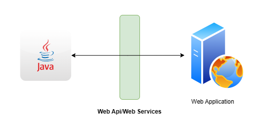

# Django Rest Framework (Restfull api)

- Django application without REST API is like a human being without hands and legs.
-  It is very, very easy technology and small technology.
- ***Mandatory technology.***
- Fewer people know this technology

1. API
2. Web API/Web Service
3. REST
4. REST API
5. Django Rest Framework

## 1. API => Application Programming Interface
   - The main objective of API is two applications can communicate with each other. API
   allows external agent to communicate (integrate and exchange information) with our
   application
   -  
   - Mobile phone keyword act as interface
   - GUI(interface)
   - ***Interoperability:*** One application can communicate to another application 
   - In a Simple way: 'Methods of communication between software components'

   - ***Note:*** Interface of communication between the user and application is nothing but API.
   The user can be Human user, an android app or desktop application etc.

## 2. Web API/Web Service:
   - The interface of communication between the user and application over the web by using
   HTTP is nothing but Web API.
   - 
   -  Eg1: By using API, a java application can communicate with a python application.
      Bookmyshow application can communicate with Payment gateway application to
      complete our booking.
   - Eg2: Authentication with Facebook
   - Every day we are using api in browser, in mobile, jio recharge, YouTube
   - API which is developed to access web application.

## 3. REST: Representational State Transfer:
   - Representational State Transfer (REST) is an architectural style.
   - It defines several Rules/guidelines to develop Web APIs/Web Services
   - By using the REST, we can develop web APIs very easily in concise way.
   - Hence, the REST is the most popular Architecture to develop Web Services.
   - The Rest is language independent

## 4. RESTFul API:
   -  The API which is developed by using REST Architecture is nothing but a RESTFul API. i.e.,
   interface between the user and application where API implements REST Architecture.
   - Note: REST is basically an architecture whereas RESTFul API is an API that implements
   REST

HTTP => Common language
   -  Through this application communicate

Common Message Formate => XML/JSON

## HTTP Verbs: 
HTTP Verbs represent the type of operation what we required. Based on requirement we have to use the corresponding HTTP verb.

The following are various HTTP Verbs

1. GET => To get one/more existing resources 
2. POST => To create a new resource 
3. PUT => To update an existing resource like update all fields of employee 
4. PATCH => To perform partial updation of an existing resource like updating only salary of employee 
5. DELETE => To delete an existing resource.

Note: These are only important HTTP Verbs. 

### The following are not that much important verbs.

- OPTIONS 
- HEAD 
- CONNECT 
- TRACE 
- LOCK
- MOVE 
- PROFIND etc

### HTTP Verbs vs Database CRUD Operations:
- C (CREATE) : POST 
- R (RETRIEVE/READ) :  GET 
- U (UPDATE) : PUT/PATCH 
- D (DELETE) : DELETE

## Types of Web Services: 

There are 2 types of web services 
1. SOAP Based WebServices 
2. RESTful WebServices

### 1. SOAP Based Web Services: 
- SOAP: Simple Object Access Protocol. 
- SOAP is an XML based protocol for accessing web services.
- To describe SOAP based web services we have to use a special language: WSDL (Web Service Description Language). 
- SOAP based web services are more secured. We can consume by using RPC Method calls. These web services can provide support for multiple protocols like HTTP, SMTP, FTP etc

#### Limitations: 
1. SOAP Based web services will always provide data only in XML format. Parsing of this XML data is very slow, which creates performance problems. 
2. Transfter of XML data over network requires more bandwidth. 
3. Implementing SOAP Based Web Services is very difficult.

Note: Because of heavy weight, less performance and more bandwidth requirements, SOAP based web services are not commonly used these days.

### 2. RESTful Web Services:
- REST stands for Representational State Transfer. It means that each unique URL is a represention of some object. We can get contents of this object by using HTTP GET, we can modify by using PUT/PATCH and we can delete by using DELETE. 
- We can create by using POST.  Most of the times RESTful web service will provide data in the form of JSON, parsing is not difficult. Hence this type of web services are faster when compared with SOAP based Web Services. 
- Transfer of JSON Data over the network requires less bandwidth.

#### Limitations: 

1. It is less secured. 
2. It provide support only for the protocols which can provide URI, mostly HTTP.

Note: Because of ligth weight, high performance, less bandwidth requirements, easy development, human understandable message format, this type of web services are most commonly used type of web services.

## Differences between SOAP and REST 

| **SOAP**                                      | **REST**                                       |
|-----------------------------------------------|------------------------------------------------|
| 1) XML-based messaging protocol               | 1) An architectural style, not a protocol      |
| 2) Uses WSDL for communication between consumer and provider | 2) Uses XML/JSON to send and receive data     |
| 3) Invokes services by using RPC method calls | 3) Invokes services by simply using a URL path |
| 4) Does not return human-readable results    | 4) Returns readable results like plain XML or JSON |
| 5) Heavyweight                                | 5) Lightweight                                 |
| 6) Requires more bandwidth                   | 6) Requires less bandwidth                    |
| 7) Can support multiple protocols like HTTP, SMTP, FTP, etc. | 7) Can support only protocols that provide URIs, mostly HTTP |
| 8) Performance is low                        | 8) Performance is high                        |
| 9) More secure                                | 9) Less secure                                 |


Note: Most of the Google web services are SOAP Based. Yahoo  RESTful eBay and Amazon using both SOAP and Restful

## Web Service Provider vs WebService Consumer:
- The application which is providing web services is called Web Service Provider. 
- The application which is consuming web data through web services, is called Web service consumer.

Eg: Bookmyshow app <--> Payment Gateway app To complete our booking, bookmyshow application will communicates with payment gateway application.
Hence payment gateway applications acts as webservice provider and bookmyshow application acts as web service consumer.


Great question! Let's explore the reasons for choosing **`requests`** vs **`httpx`** in FastAPI, and why I initially used `requests` in the example, but also mentioned `httpx` as a more suitable option for asynchronous calls.

### Why Use **`requests`** (Synchronous)?
**`requests`** is a widely-used, easy-to-understand library for making HTTP requests. It's **synchronous**, meaning the application will wait for the HTTP request to complete before moving on to the next task. It’s a good choice in the following scenarios:

1. **Simplicity and Readability**: `requests` is known for its simplicity and readability, making it easy to use for beginners or those working on smaller projects. The code looks clean and the syntax is intuitive.
   
2. **Blocking Operations**: If your FastAPI application doesn't need to handle multiple concurrent tasks (e.g., if it’s low-traffic or doesn’t involve large-scale data fetching), using `requests` might be perfectly fine. It's simple to implement when you're building an API or application that doesn't need the added complexity of asynchronous behavior.

3. **No Need for Concurrency**: If you don’t have multiple HTTP requests happening at once, using `requests` might make your life easier since you don't need to deal with async/await.

#### Example Use Case for `requests`:
If your FastAPI API is fetching data from another API on a relatively small scale, and you don't mind the application being "blocked" while it waits for the response, `requests` will do the job. It simplifies the development process and is good enough for small, straightforward applications.

### Why Use **`httpx`** (Asynchronous)?
**`httpx`** is an asynchronous HTTP client designed for high-performance applications. FastAPI is built with async and await functionality in mind, and using `httpx` aligns well with FastAPI's capabilities. Here are some key reasons why **`httpx`** is the preferred choice in an asynchronous environment:

1. **Asynchronous Requests**: 
   - **`httpx`** is designed for asynchronous calls, meaning it does not block your application while waiting for a response. This allows your FastAPI application to handle multiple HTTP requests concurrently, leading to better performance in high-traffic scenarios.
   - With **`httpx`**, you can handle many requests at once without waiting for each one to finish before starting the next. This is ideal for APIs that need to fetch data from multiple sources simultaneously or those with high concurrent users.

2. **Non-Blocking**:
   - FastAPI works well with asynchronous frameworks. If you're making HTTP requests in an endpoint and need to perform additional tasks (like querying databases, fetching multiple APIs, or processing data), using `httpx` ensures that your server doesn't block and waits for each task to finish sequentially.
   - **`httpx`** leverages the async I/O model in Python, which can handle thousands of requests concurrently without waiting for each one to finish.

3. **Better Scalability**:
   - For APIs with high concurrency (like real-time data fetching from external services or high-frequency updates), using **`httpx`** can significantly improve performance, as FastAPI is designed for async operation. Without async I/O, a synchronous request with **`requests`** would block the server during the request/response cycle, making it less efficient under load.

4. **HTTP/2 Support**:
   - **`httpx`** also supports HTTP/2, which can improve performance for some applications by enabling multiplexing (multiple requests on a single connection).

5. **More Control**: 
   - **`httpx`** provides advanced features like connection pooling, handling streaming responses, and customizable timeouts, which can give you more control over how your requests are managed.

#### Example Use Case for `httpx`:
If your FastAPI application is interacting with multiple APIs, handling high traffic, or needs to fetch data concurrently from many sources, **`httpx`** is the better choice as it won't block the server while waiting for responses and will handle multiple requests efficiently.

### When to Use `requests` vs `httpx` in FastAPI:

| **Feature**                        | **`requests`** (Synchronous)                              | **`httpx`** (Asynchronous)                          |
|------------------------------------|---------------------------------------------------------|---------------------------------------------------|
| **Concurrency Handling**           | Blocks the event loop, handles one request at a time    | Non-blocking, handles multiple requests concurrently |
| **Performance with High Traffic**  | Slower, as each request blocks the thread                | Faster for high concurrency, as requests are non-blocking |
| **Ease of Use**                    | Simpler, easy to understand and use                     | Requires knowledge of async programming, more complex |
| **Ideal Use Case**                 | Small apps with low traffic, or simple applications     | High-concurrency apps, APIs fetching from multiple sources |
| **Integration with FastAPI**       | Works fine for small projects                           | Best for projects designed for high concurrency and scalability |

### Example:

#### Using **`requests`** (Simple, Blocking):
```python
import requests
from fastapi import FastAPI

app = FastAPI()

@app.get("/fetch-todo/{todo_id}")
async def fetch_todo(todo_id: int):
    url = f"https://jsonplaceholder.typicode.com/todos/{todo_id}"
    response = requests.get(url)
    return response.json()
```

In this example, FastAPI will wait for `requests.get(url)` to complete before processing the next request. If multiple users hit the endpoint simultaneously, each request will wait for the previous one to finish.

#### Using **`httpx`** (Async, Non-Blocking):
```python
import httpx
from fastapi import FastAPI

app = FastAPI()

@app.get("/fetch-todo/{todo_id}")
async def fetch_todo(todo_id: int):
    url = f"https://jsonplaceholder.typicode.com/todos/{todo_id}"
    async with httpx.AsyncClient() as client:
        response = await client.get(url)
    return response.json()
```

With **`httpx`**, FastAPI can handle multiple requests concurrently without waiting for the response of each individual one. This is especially useful for high-traffic APIs or applications that need to perform multiple I/O-bound operations.

### Conclusion:
- **`requests`** is simple and easy to use, and works fine for small applications or scenarios where concurrency isn’t a concern.
- **`httpx`** is a better choice for asynchronous applications that need to handle multiple requests concurrently and scale efficiently. FastAPI is designed to work with asynchronous frameworks, so **`httpx`** integrates better with FastAPI for optimal performance.

If your FastAPI app is expected to handle a lot of traffic or needs to fetch data from multiple sources concurrently, **`httpx`** is the better choice. However, for smaller applications, **`requests`** might be sufficient, especially when simplicity and quick development are more important.

Let me know if you need further clarification!