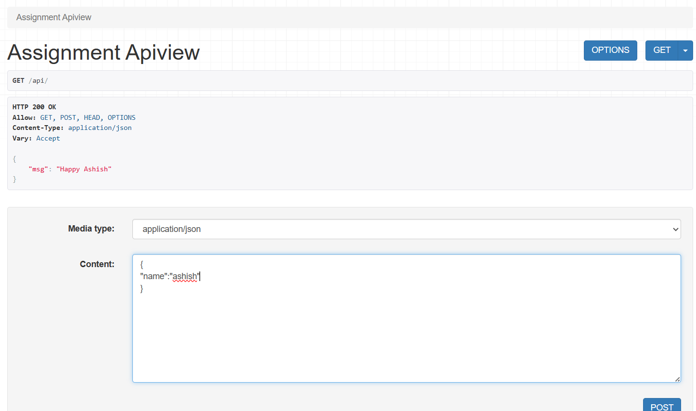
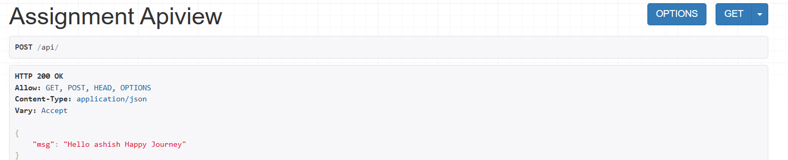
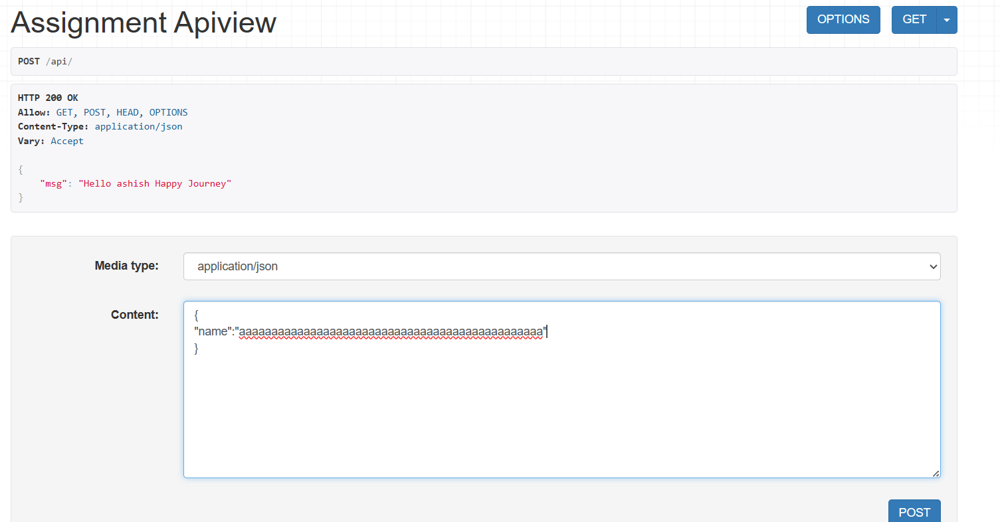
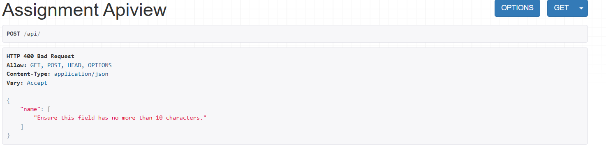
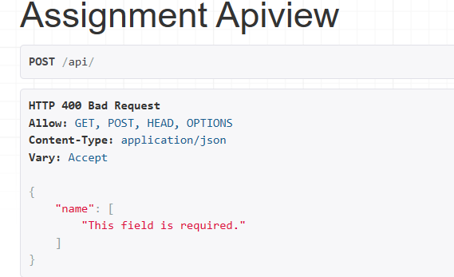

# Projects

## DRF projects

## Installation

- Install using pip, including any optional packages you want...

  - `pip install djangorestframework`
  - `pip install markdown`      # Markdown support for the browsable API.
  - `pip install django-filter`  # Filtering support

### Step - 1

```sh
 django-admin startproject project_name
```

### Step - 2

```sh
cd project_name
py manage.py startapp appname
```

### Step - 3

Add `rest_framework` to your INSTALLED_APPS setting.

  ```py
  INSTALLED_APPS = [
      ...
      'rest_framework',
  ]
  ```

> add app name also

### Step - 4

- Go to appname/view.py
- Response() => convert python dict to json data
- Response() provided by drf

```py
from rest_framework.views import APIView
class AssignmentAPIVIEW(APIView):
  def get(self, request, *args, **kwargs):
      return Response({"msg": "Happy Ashish"})
```

### Step - 5

- goto `urls.py`

```py
from appname import views
urlpatterns = [
    path('admin/', admin.site.urls),
    path('api/',views.TestAPIVIEW.as_view())
]
```

### Step - 6

```sh
py manage.py makemigrations
py manage.py migrate
```

### Step -7

***Browsable api***

```sh
py manage.py runserver
```

## POST Request

- Partner application will send some `json_data`
- some conversion must be required to convert some data in python dict for serializer must be required
- if model is not there and the normal daata is there then dont go for model_serializer go for normal serializer
- 
- 
- 
- 
- if we don't write anything, if we send empty data
  - 
- internal csrf certification is send by browsable api
